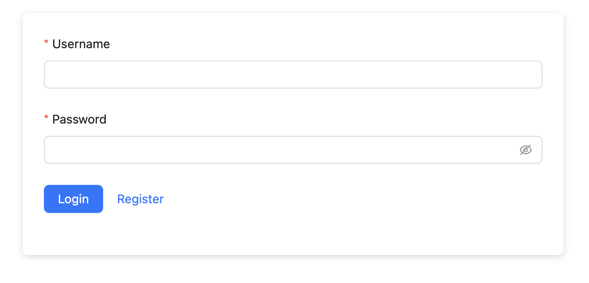
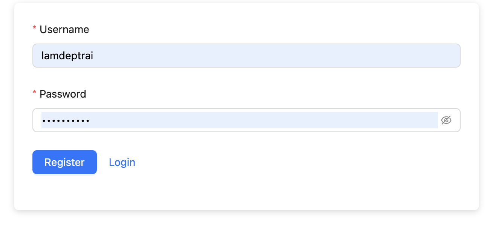
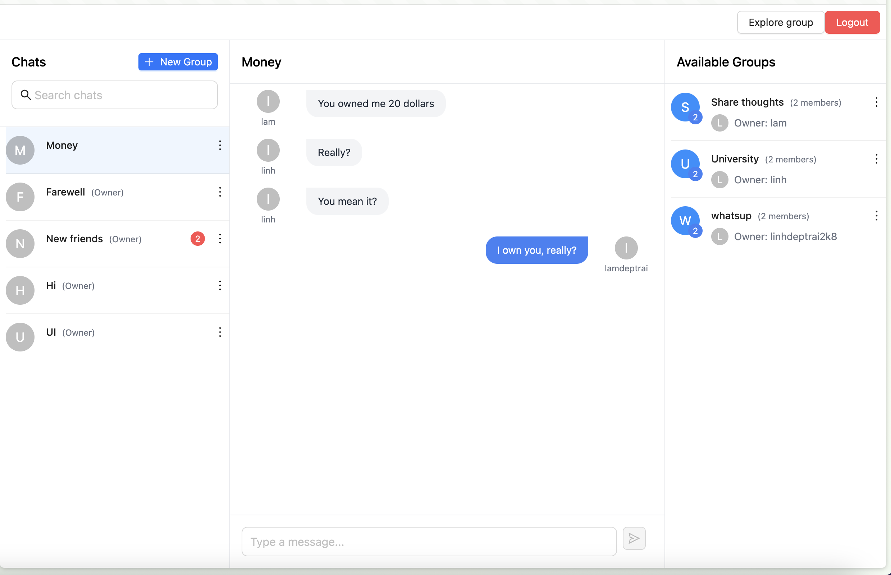
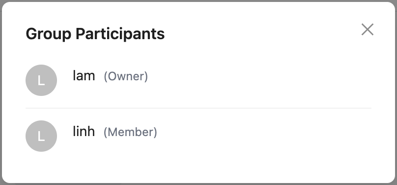
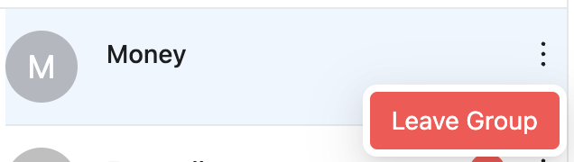
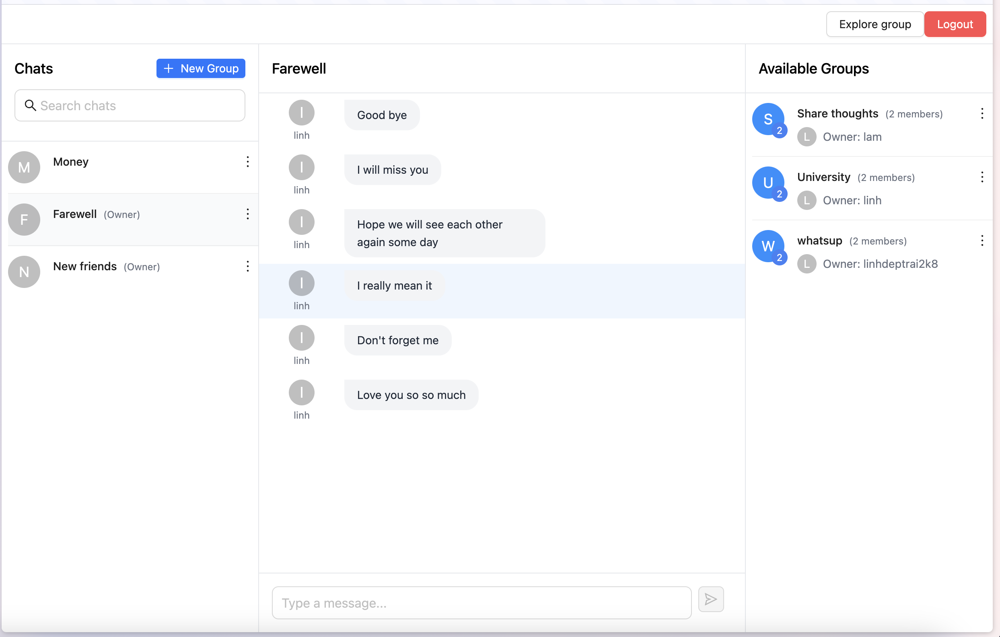
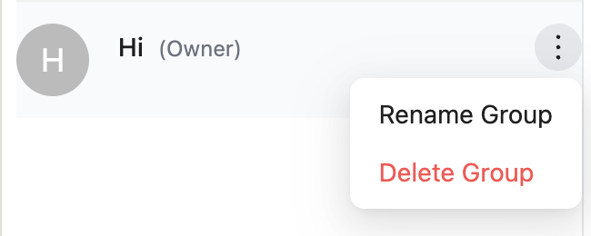
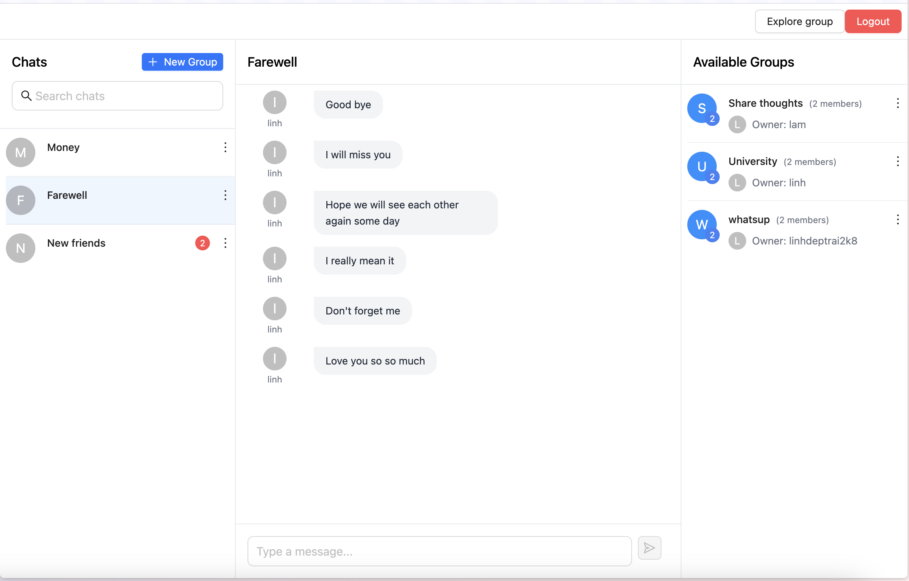

# Dự án forum chat

## Mô tả dự án

- Là 1 ứng dụng nhắn tin nhóm, cho phép người dùng tạo ra các nhóm chat, tham gia các nhóm chat đã có, rời khỏi nhóm chat. gửi tin nhắn trong nhóm chat. Nhận thông báo khi có tin nhắn mới trong nhóm chat.
- Đã được deploy tại: [Forum chat](http://164.92.169.90:5173/login) bằng digital ocean, nhưng có thể không hoạt động vì đã hết thời gian trial (16/4/2025)

## Công nghệ sử dụng

- Backend: Golang, Gin, Gorm, Postgres, Melody(websocket), JWT
- Frontend: React, Vite, Tailwind css, AntUI, Websocket, Axios, react-router-dom, formik, react-infinite-scroll-component
- Devops: Docker, Docker-compose, Digital ocean
- Architecture: Clean architecture, FSD (Feature Slices Design)

## Các tính năng:

- Đăng ký, đăng nhập
- Xác thực JWT
- Tạo nhóm chat
- Tham gia nhóm chat
- Rời khỏi nhóm chat
- Gửi tin nhắn trong nhóm chat
- Nhận thông báo khi có tin nhắn mới trong nhóm chat
- Đếm số tin nhắn chưa đọc
- Xem các thành viên trong nhóm chat
- Đếm số thành viên trong nhóm chat
- Search các nhóm chat đã tham gia
- Xem lịch sử tin nhắn trong nhóm chat

## Cài đặt

- Tạo file `local.yaml` trong thư mục `infrastructure/config` với nội dung như sau và điền thông số cần thiết:
  - ```yaml
    database:
      host: localhost
      port: 5432
      user:
      password:
      database:
    jwt:
      key:
    ```
- Chạy các lệnh sau:

```bash
docker-compose up -d
npm install
npm run dev
```

## Screenshot











